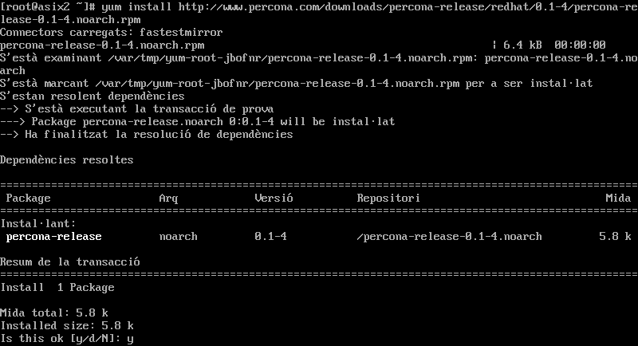
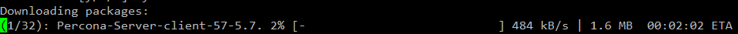
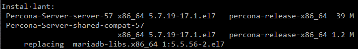
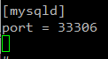

# Pràctica 1

## Part - 1 Percona Server

1. Indica clarament els passos per reprodurïr la instal·lació en un altra màquina.

- Instal·lació de Percona.  

Primer descarreguem el paquet de Percona des de la seva URL <b>http://www.percona.com/downloads/percona-release/redhat/0.1-4/percona-release-0.1-4.noarch.rpm</b>.
  
Una vegada descarregat el RPM podem revisar si tenim els repositoris <b><i>yum list | grep percona</i></b> i poder seleccionar la nostra verció a instal·lar.  
Per instal·lar el Percona utilitzem la següent comanda <b><i>yum install Percona-Server-server-56</i></b>, el nom varia depenent de la versió.  
  
Esperem a que descargui lo necessari per a la instal·lació i ja estariem de la instal·lació, nomes faltaria comprovar si el servei esta en execució.  
  

 - Securització:

2. Quines són les instruccions per arrancar / verificar status / apagar servei de la base de dades de Percona Server.  
<b><i>service mysql start | stop | restart | status</i></b>

3. A on es troba i quin nom rep el fitxer de configuració del SGBD Percona Server?  
Els fitxer de configuració es troben en <b><i>/etc/my.cnf</i></b>

4. A on es troben físicament els fitxers de dades (per defecte)  
Els fitxers es guarden fisicament en <b><i>/var/lib/mysql</i></b>

5. Crea un usuari anomenat asix en el sistema operatiu i en SGBD de tal manera que aquest usuari del sistema operatiu no hagi d'introduir l'usuari i password cada vegada que cridem al client mysql?  

6. El servei de MySQL (mysqld) escolta al port 3306. Quina modificació/passos caldrien fer per canviar aquest port a 33306 per exemple? Important: No realitzis els canvis. Només indica els passos que faries.  
Primer tindriem que configurar el arxiu <b><i>my.cnf</i></b> i afeguir les següents linies en el fitxer.  
  
Guardem i reiniciem el servei <b><i>service mysql restart</i></b>

   

## Part - 2 MongoDB

1. Instal·lació.

2. Connexió a MongoDB.  
Per poder-nos connectar a la base de dades de MongoDB tenim que introduïr lo següent: <b><i>/bin/mongo</i></b> o de la forma mes sencilla <b><i>mongo -u dbuser -p dbpassword</i></b>
