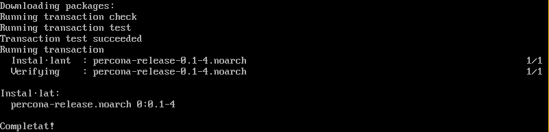
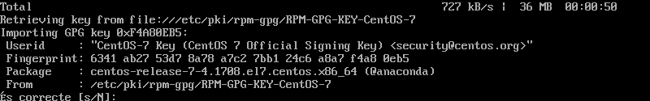
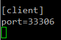

# Pràctica 1

1. Indica clarament els passos per reprodurïr la instal·lació en un altra màquina.

- Instal·lació de Percona

2

3

4

6

1. Quines són les instruccions per arrancar / verificar status / apagar servei de la base de dades de Percona Server.  
<b><i>service mysql start | stop | restart | status</i></b>

2. A on es troba i quin nom rep el fitxer de configuració del SGBD Percona Server?  
Els fitxer de configuració es troben en <b><i>/etc/my.cnf</i></b>

3. A on es troben físicament els fitxers de dades (per defecte)  
Els fitxers es guarden fisicament en <b><i>/var/lib/mysql</i></b>

4. Crea un usuari anomenat asix en el sistema operatiu i en SGBD de tal manera que aquest usuari del sistema operatiu no hagi d'introduir l'usuari i password cada vegada que cridem al client mysql?  

5. El servei de MySQL (mysqld) escolta al port 3306. Quina modificació/passos caldrien fer per canviar aquest port a 33306 per exemple? Important: No realitzis els canvis. Només indica els passos que faries.  
Primer tindriem que configurar el arxiu <b><i>my.cnf</i></b> i afeguir les següents linies en el fitxer.  
  
Guardem i reiniciem el servei <b><i>service mysql restart</i></b>
