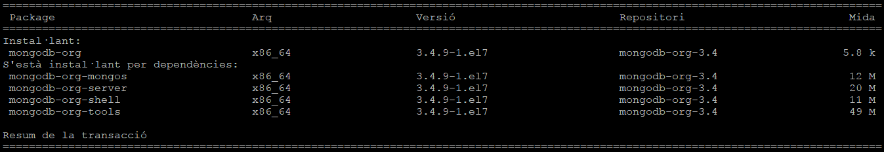
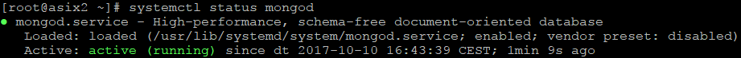

# Pràctica 1

## Part - 1 Percona Server

1. Indica clarament els passos per reprodurïr la instal·lació en un altra màquina.

- Instal·lació de Percona.  

Primer descarreguem el paquet de Percona des de la seva URL <b>http://www.percona.com/downloads/percona-release/redhat/0.1-4/percona-release-0.1-4.noarch.rpm</b>.
  
Una vegada descarregat el RPM podem revisar si tenim els repositoris <b><i>yum list | grep percona</i></b> i poder seleccionar la nostra verció a instal·lar.  
Per instal·lar el Percona utilitzem la següent comanda <b><i>yum install Percona-Server-server-56</i></b>, el nom varia depenent de la versió.  
  
Esperem a que descargui lo necessari per a la instal·lació i ja estariem de la instal·lació, nomes faltaria comprovar si el servei esta en execució.  
  

- Securització:

2. Quines són les instruccions per arrancar / verificar status / apagar servei de la base de dades de Percona Server.  
<b><i>service mysql start | stop | restart | status</i></b>

3. A on es troba i quin nom rep el fitxer de configuració del SGBD Percona Server?  
Els fitxer de configuració es troben en <b><i>/etc/my.cnf</i></b>

4. A on es troben físicament els fitxers de dades (per defecte)  
Els fitxers es guarden fisicament en <b><i>/var/lib/mysql</i></b>

5. Crea un usuari anomenat asix en el sistema operatiu i en SGBD de tal manera que aquest usuari del sistema operatiu no hagi d'introduir l'usuari i password cada vegada que cridem al client mysql?  

6. El servei de MySQL (mysqld) escolta al port 3306. Quina modificació/passos caldrien fer per canviar aquest port a 33306 per exemple? Important: No realitzis els canvis. Només indica els passos que faries.  
Primer hauríem de configurar l'arxiu <b><i>my.cnf</i></b> i afegir les següents linies en el fitxer.  
  
Guardem i reiniciem el servei <b><i>service mysql restart</i></b>

   

## Part - 2 MongoDB

1. Instal·lació.  

S’ha de crear el fitxer  “mongodb-org-3.4.repo” a l’arrel “/etc/yum.repos.d” amb la següent informació dins:  

<i> [mongodb-org-3.4]  
    name=MongoDB Repository  
    baseurl=https://repo.mongodb.org/yum/redhat/7Server/mongodb-org/3.4/x86_64  
    gpgcheck=1  
    enabled=1   
    gpgkey=https://www.mongodb.org/static/pgp/server-3.4.asc </i>
 
    
A continuació executem la comanda yum install per instal·lar MongoDB: <b><i>yum install -y mongodb-org</b></i>  
  Aquesta comanda ens instal·larà tots els paquets necessaris per utilitzar MongoDB 
Per iniciar el servei de mongodb (mongod), utilitzem la comanda: <b><i>service mongod start</b></i>  
A més també podem comprovar que el servei està actiu amb: <b><i>systemctl status mongod</b></i>. Si està actiu, estarà <i>active (running)</i>, sino estarà <i>inactive (dead)</i>  

2. Connexió a MongoDB.  

Per entrar a la shell de MongoDB, només cal cridar al programa utilitzant la paraula <i><b>mongo</i></b>  
Un cop allà, podem anar canviant entre BD amb la comanda <i><b>use [nomdb]</i></b>  
Per crear un usuari (amb rols a la BD), hem de fer un petit script. L'usuari es crearà a la DB on estem situats. Aquí hi ha un petit exemple, on hi afegim un parell de rols:   
Per poder connectar-nos a la base de dades de MongoDB amb el nostre usuari, hem d'introduïr la següent comanda: <b><i>db.auth('[usuari]','[contrasenya]')</i></b>.
