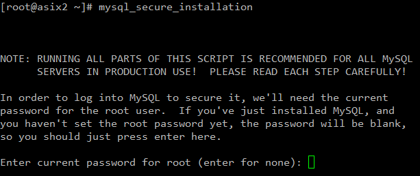
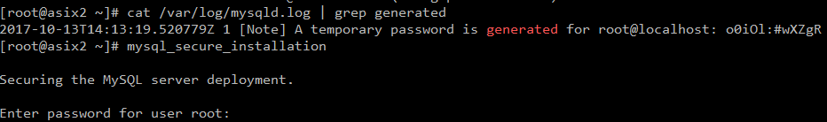
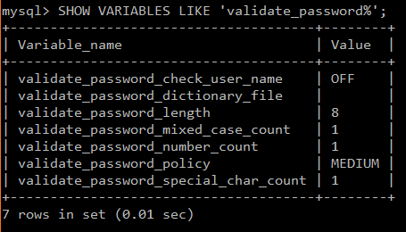
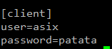
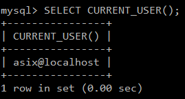
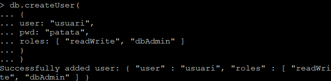

# Pràctica 1

## Part - 1 Percona Server

1. Indica clarament els passos per reprodurïr la instal·lació en un altra màquina.

- Instal·lació de Percona.  

Primer descarreguem el paquet de Percona des de la seva URL <b>http://www.percona.com/downloads/percona-release/redhat/0.1-4/percona-release-0.1-4.noarch.rpm</b>.
  
Una vegada descarregat el RPM, podem revisar si tenim els repositoris <b><i>yum list | grep percona</i></b> i poder seleccionar la versió que volem instal·lar.  
Per instal·lar el Percona utilitzem la següent comanda <b><i>yum install Percona-Server-server-57</i></b>, el nom varia depenent de la versió, en aquest cas instal·larem la més recent, que és la 5.7.  
  
Esperem a que descargui els arxius necessaris per la instal·lació. Un cop finalitzada, només faltaria comprovar si el servei esta en execució.  
  

- Securització:  

Per poder fer la securització de MySQL Percona, es tant senzill com escriure la comanda <b><i>mysql_secure_installation</i></b>. Això ens obrirà un petit asistent per donar seguretat bàsica al nostre mysql.  
  
Es posible que la contrasenya no sigui la que tinguem en el nostre ordinador, aixì que segurament el mateix Percona ens generarà una contrasenya segura.  
Per saber quina és utilitzarem la següent comanda:  
  
Segurament no podrem canviar la contrasenya a <b><i>'patata'</i></b> ja que no compleix la politica de seguretat mínima que aquesta versió té predefinida. Per poder-ho canviar hem d'entrar a MySQL i executar la següent comanda per saber quina es la politica actual.  
  
I per modificar la politica es tant senzill com modificar el fitxer <b><i>my.cnf</i></b> i agregar les següents linies al fitxer.  
  

2. Quines són les instruccions per arrancar / verificar status / apagar servei de la base de dades de Percona Server?  
<b><i>service mysql start | stop | restart | status</i></b>

3. A on es troba i quin nom rep el fitxer de configuració del SGBD Percona Server?  
Els fitxers de configuració es troben a <b><i>/etc/my.cnf</i></b>

4. A on es troben físicament els fitxers de dades (per defecte)  
Els fitxers es guarden fisicament en <b><i>/var/lib/mysql</i></b>

5. Crea un usuari anomenat asix en el sistema operatiu i en SGBD de tal manera que aquest usuari del sistema operatiu no hagi d'introduir l'usuari i password cada vegada que cridem al client mysql?  
Per fer-ho primer hem de crear l'usuari dins del sistema operatiu, i despres a MySQL.  
Després tenim que configurar el fitxer my.cnf i introduïr les següents línies:  
  
I per comprovar que hem entrat amb aquest usuari utilitzem la següent sentència SQL.  
  

6. El servei de MySQL (mysqld) escolta al port 3306. Quina modificació/passos caldrien fer per canviar aquest port a 33306 per exemple? Important: No realitzis els canvis. Només indica els passos que faries.  
Primer hauríem de configurar l'arxiu <b><i>my.cnf</i></b> i afegir les següents linies al fitxer.  
  
Guardem i reiniciem el servei <b><i>service mysql restart</i></b>

   

## Part - 2 MongoDB

1. Instal·lació.  

S’ha de crear el fitxer  “mongodb-org-3.4.repo” a l’arrel “/etc/yum.repos.d” amb la següent informació dins:  

<i> [mongodb-org-3.4]  
    name=MongoDB Repository  
    baseurl=https://repo.mongodb.org/yum/redhat/7Server/mongodb-org/3.4/x86_64  
    gpgcheck=1  
    enabled=1   
    gpgkey=https://www.mongodb.org/static/pgp/server-3.4.asc </i>
 
    
A continuació executem la comanda yum install per instal·lar MongoDB: <b><i>yum install -y mongodb-org</b></i>  
Aquesta comanda ens instal·larà tots els paquets necessaris per utilitzar MongoDB 
Per iniciar el servei de mongodb (mongod), utilitzem la comanda: <b><i>service mongod start</b></i>  
A més també podem comprovar que el servei està actiu amb: <b><i>systemctl status mongod</b></i>. Si està actiu, estarà <i>active (running)</i>, sino estarà <i>inactive (dead)</i>  

2. Connexió a MongoDB.  

Per entrar a la shell de MongoDB, només cal cridar al programa utilitzant la paraula <i><b>mongo</i></b>  
Un cop allà, podem anar canviant entre BD amb la comanda <i><b>use [nomdb]</i></b>  
Per crear un usuari (amb rols a la BD), hem de fer un petit script. L'usuari es crearà a la DB on estem situats. Aquí hi ha un petit exemple, on hi afegim un parell de rols:   
Per poder connectar-nos a la base de dades de MongoDB amb el nostre usuari, hem d'introduïr la següent comanda: <b><i>db.auth('[usuari]','[contrasenya]')</i></b>.  
Per sortir del shell de MongoDB, simplement hem d'escriure <i><b>exit</i></b>.
