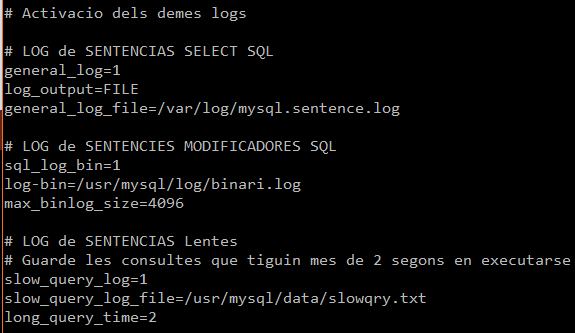
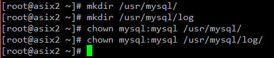
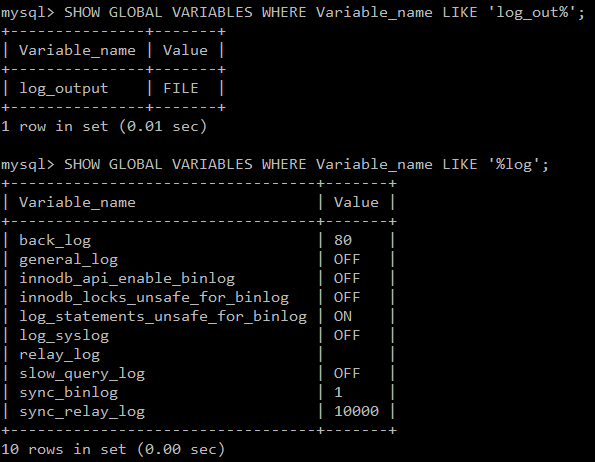
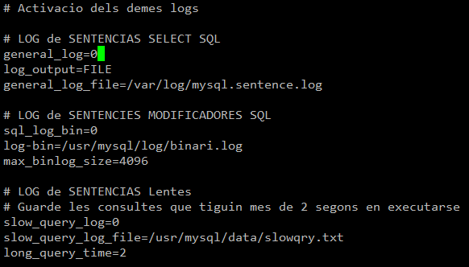
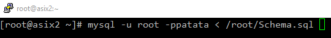

# Configuració SGBD

1. Quins són els logs activats per defecte? Com ho has fet per comprovar-ho?  
Entrant a mysql i provant la següent sentencia SQL <b><i>SHOW GLOBAL VARIABLES WHERE Variable_name LIKE ‘%log%’ AND (Value = ‘1’ OR Value = ‘ON’)</i></b>, que ens mostrara una llista de tots els logs que estiguin activats.  
Activa si no ho estan i indica les configuracions necessàries per activar-los. Indica les rutes dels fitxer de log de Binary, Slow Query i General. Quins paràmetres has modificat?  
Per activar els logs primer tenim que editar el fitxer  <b><i> /etc/percona-server </i> </b> i insertar lo següent.  
  
Teni que crear també les carpetes i donar-li permisos.  
  

2. Comprova l'estat de les opcions de log que has utilitzat mitjançant una sessió de mysql client.  
Per comprovar si estan activats fem servir la sentencia SQL que em fet servir abans.  
  
3. Modifica el fitxer de configuració i desactiva els logs de binary, slow query i genral. Nota: Simplament desactiva'ls no borris altres paràmetres com la ruta dels fitxers, etc...  
Per fer-ho nomes tenim que editar el fitxer i canviar el valor d'activacio que es <b><i>''</i></b> per el valor de desactivació que es <b><i>'0'</i></b>.  
  

4. Activa la els logs en temps d'execució mitjançant la sentència SET GLOBAL. També canvia el destí de log general a una taula (paràmetre log_output). Quines són les sentències que has utilitzat? A quina taula registres els logs general?  

5. Carrega la BD Sakila localitzada a la web.  
  

6. Compte el numero de sentències CREATE TABLE dins del general log mitjançant:  

7. Executa una query mitjançant la funció SLEEP(11) per tal de que es guardi en el log de Slow Query. Mostra el contingut del log demostrant-ho.  

8. Assegura't que el Binary Log estigui activat i borra tots els logs anteriors mitjançant la sentència RESET MASTER.  
