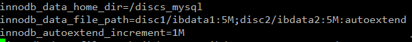

# Pràctica 3

## Activitat 1. REALITZA I/O RESPON ELS SEGÜENTS APARTATS

1. Indica quins són els motors d’emmagatzematge que pots utilitzar (quins estan actius)? Mostra al comanda utilitzada i el resultat d’aquesta. 

Per veure els motors d'emmagatzematge que podem utilitzar, utilitzarem la comanda <i><b>SHOW ENGINES;</b></i>.
   

2. Com puc saber quin és el motor d’emmagatzematge per defecte? Mostra com canviar aquest paràmetre de tal manera que les noves taules que creem a la BD per defecte utilitzin el motor MyISAM?

Amb la mateixa comanda anterior,  a la columna "SUPPORT", podem veure els motors d'emmagatzematge actius (<i>YES</i>), els que no ho estàn (<i>NO</i>) i el motor d'emmagatzematge per defecte (<i>DEFAULT</i>). Per canviar el motor d'emmagatzematge per defecte a MyISAM, hem d'editar el fitxer de configuració <i><b>mysqld.cnf</b></i> i posar el paràmetre <i>default-storage-engine=[Nom]</i>.   

Per veure si el canvi ha estat correcte, tornem a utilitzar la comanda <i><b>SHOW ENGINES;</b></i>.  
   

3. Explica els passos per instal·lar i activar l'ENGINE MyRocks. MyRocks és un motor d'emmagatzematge per MySQL basat en RocksDB (SGBD incrustat de tipus clau-valor). 

Per instal·lar el motor d'emmagatzematge MyRocks, hem d'utilitzar la comanda <i><b>yum install Percona-Server-rocksdb-57.x86_64</b></i> (el número "57" pot variar segons la versió MySQL que tenim instal·lada).    

    Consell: Per utilitzar comandes de Linux dins del shell de MySQL, podem fer servir \!

Un cop instal·lat l'engine MyRocks, l'hem d'activar. Per fer-ho, només hem de posar la comanda <i><b>ps-admin --enable-rocksdb -u root -p[contrasenya]</b></i>. Més informació sobre MyRocks a Percona Server: https://www.percona.com/doc/percona-server/LATEST/myrocks/install.html   

Per finalitzar, comprovem que MyRocks estigui instal·lat i activat utilitzant la comanda <i><b>SHOW ENGINES;</b></i>.      

4. Importa la BD Sakila com a taules MyISAM. Fes els canvis necessaris per importar la BD Sakila perquè totes les taules siguin de tipus MyISAM. Mira quins són els fitxers físics que ha creat, quan ocupen i quines són les seves extensions. Mostra'n una captura de pantalla i indica què conté cada fitxer. 

Per importar una BD amb l'engine que volem, hem de modificar l'esquema DDL de la BD, i posar-hi el motor d'emmagatzematge amb el que volem guardar les taules utilitzant <i><b>ENGINE=MyISAM</b></i>. També és aconsellable tenir MyISAM com a engine predeterminat a l'hora d'importar la BD.     

Ara només falta importar l'esquema de la BD Sakila. Per fer-ho, podem utilitzar la comanda <i><b>SOURCE /arrel/schema.sql</b></i> dins la shell de MySQL.     

Per veure els fitxers que ens ha creat la BD i quant ocupen, utilitzarem la comanda <i><b>ls -ls /var/lib/mysql/sakila</b></i>, que és el directori on es situa l'informació de la nostra BD.     

Hi ha 6 extensions diferents, i cada document, segons al seva extensió, una conté certa informació sobre cada taula.  

- .frm: Guarda la informació de la estructura de la taula.
- .MYI: Guarda la informació dels índex de la taula.
- .MYD: Guarda les dades de la taula.
- .opt: Guarda la configuració de la DB.
- .TRG: Conté els triggers que estan associats a la taula.
- .TRN: Conté el nom dels triggers associats a la taula. Juntament amb el .TRG, aquest fitxer defineix el trigger.

 

## Activitat 2. INNODB part I. REALITZA ELS SEGÜENTS APARTATS

1. Importa la BD Sakila com a taules InnoDB.  

Abans d'importar la BD, comprovem que totes les taules de l'esquema Sakila tinguin l'engine de les taules amb InnoDB (igual que a la primera imatge de l'exercici 4 de l'activitat 1). També configurem el fitxer <i>my.cnf</i> amb el paràmetre <i>default-storage-engine=InnoDB</i> perquè el motor per defecte sigui InnoDB (com en l'exercici 2 de activitat 1).

Un cop fets aquests passos, importem la BD amb la comanda <i><b>SOURCE</b></i>.      

2. Quin/quins són els fitxers de dades? A on es troben i quin és la seva mida?  

Un cop importada la BD, podem veure els fitxers amb la comanda utilitzada en l'exercici anterior: <i><b>ls -ls /var/lib/mysql/sakila</b></i>, i veiem que alguns fitxers tenen una extensió diferent a quan hem utilitzat MyISAM.     

La principal diferència és que no té extensions .MYI ni .MYD, però les extensions .frm, .opt, .TRG i .TRN les manté. L'extensió nova és la següent:  

- .ibd: Guarda les dades i els índexs de les taules o de cada taula en cas de que estiguin els fitxers individuals.

Utilitzant l'engine InnoDB, les dades es guardaran a la ruta <i><b>/var/lib/mysql</b></i>, i el fitxer s'anomena <i>ibdata1</i>.      

3. Canvia la configuració del MySQL perquè:  

    1. Canviar la localització dels fitxers del tablespace de sistema per defecte a /discs-mysql/
    2. Tinguem dos fitxers corresponents al tablespace de sistema.
    3. Tots dos han de tenir la mateixa mida inicial (5MB) 
    4. El tablespace ha de creixer de 1MB en 1MB.
    5. Situa aquests fitxers (de manera relativa a la localització per defecte) en una nova localització simulant el següent:
        1. /discs-mysql/disk1/primer fitxer de dades → simularà un disc dur
        2. /discs-mysql/disk2/segon fitxer de dades → simularà un segon disc dur.  
        
Per canviar la ruta dels fitxers de tablespace, hem de posar el paràmetre de configuració <i>innodb_data_home_dir</i> amb la ruta que volem al fitxer <i>mysqld.cnf</i>.

Per poder generar dis fitxers i amb la mida que nosaltres volem, hem d'utilitzar el paràmetre <i>innodb_data_file_path</i>. Per definir la mida de cada fitxer, utilitzarem dos punts (:) i per definir un altre fitxer, utilitzarem punt i coma (;). També podem definir-hi la ruta, juntament amb el nom. En aquest cas hem creat un fitxer al directori <i><b>disc1/</b></i> i l'altre a <i><b>disc2/</b></i>. Com a mínim ha de ser de 5MB.

Per poder canviar la mida de l'autoincrement del nostre tablespace, utilitzarem el paràmetre <i>innodb_autoextend_increment</i>. Per defecte, si no confgurem aques paràmetre, s'autoincrementarà de 8MB en 8MB.  

La configuració quedarà així:     

I aquest és el missatge d'error que veiem al .log quan la mida inicial està configurada en només 1MB.      

