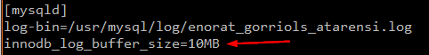

# Pràctica 5

## REPLICACIÓ via Binlog

Es vol muntar entorn SGBD MySQL Percona amb rèplica. Es vol tenir un MySQL <i>master</i> a on s'aniran enviant totes les instruccions SQL d'inserció, modificació i esborrat. Es vol tenir un MySQL <i>esclau</i> del <i>master</i> anteriorment esmentat.  

Cal que que al realitzar un INSERT en el master veiem les dades a l'esclau al cap d'un instant de temps.  

### Configuració <i>Master</i>

- Realitza una còpia del fitxer de configuració del MySQL /etc/my.conf --> /etc/my.conf.bkp  

Copiem l'arxiu utilitzant la comanda de còpia d'arxius de Linux <i><b>cp /etc/my.cnf /etc/my.cnf.bkp</b></i>.     

Finalment, comprovem si hem copiat l'arxiu correctament al directori on pertoca.     

- Modifica el fitxer <i>/etc/my.conf</i> i activa el paràmetre <i><b>log-bin</b></i> (tal i com vàreu fer a M02) amb el nom: <i><PRIMER LLETRA DEL NOM + 1r COGNOM>rep</i>.  

Modifiquem el fitxer <i>my.cnf</i> afegint-hi el paràmetre <i><b>log-bin=enorat_gorriols_atarensi.log</b></i>.     

- Verifica que el paràmetre server-id té un valor numèric (per defecte és 1).  

Hem de reiniciar el servei de MySQL després d'haver fet el canvi anterior per guardar-lo, i un cop ho haguem fet, comprovem el log que hem creat utilitzant la comanda <i><b>mysqlbinlog /usr/mysql/log/enorat_gorriols_atarensi.000001</b></i>.     

- Verifica que tots els paràmetres de InnoDB estiguin descomentats.  

Tots els paràmetres venen descomentats a la versió 5.7 de Percona-Server, per tant, no hem hagut de modificar res. En cas de que volguem comentar algun paràmetre, només hem d'utilitzar el hashtag (<i>#</i>).  

- Canvia el paràmetre <i>innodb_log_buffer</i> a 10M.  

Entrem al fitxer de configuració i hi afegim el paràmetre <i><b>innodb_log_buffer_size=10MB</b></i> per canviar la mida dels logs.   
