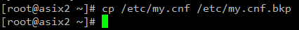

# Pràctica 4

## REPLICACIÓ via Binlog

Es vol muntar entorn SGBD MySQL Percona amb rèplica. Es vol tenir un MySQL <i>master</i> a on s'aniran enviant totes les instruccions SQL d'inserció, modificació i esborrat. Es vol tenir un MySQL <i>esclau</i> del <i>master</i> anteriorment esmentat.  

Cal que que al realitzar un INSERT en el master veiem les dades a l'esclau al cap d'un instant de temps.  

### Configuració <i>Master</i>

- Realitza una còpia del fitxer de configuració del MySQL /etc/my.conf --> /etc/my.conf.bkp  

Copiem l'arxiu utilitzant la comanda de còpia d'arxius de Linux <i><b>cp /etc/my.cnf /etc/my.cnf.bkp</b></i>.     

Finalment, comprovem si hem copiat l'arxiu correctament al directori on pertoca.     

- Modifica el fitxer <i>/etc/my.conf</i> i activa el paràmetre <i><b>log-bin</b></i> (tal i com vàreu fer a M02). Amb el nom: <i><PRIMER LLETRA DEL NOM + 1r COGNOM>rep</i>  

