# Pràctica 5

## REPLICACIÓ via Binlog

Es vol muntar entorn SGBD MySQL Percona amb rèplica. Es vol tenir un MySQL <i>master</i> a on s'aniran enviant totes les instruccions SQL d'inserció, modificació i esborrat. Es vol tenir un MySQL <i>esclau</i> del <i>master</i> anteriorment esmentat.  

Cal que que al realitzar un INSERT en el master veiem les dades a l'esclau al cap d'un instant de temps.  

### Configuració <i>Master</i>

 

- Realitza una còpia del fitxer de configuració del MySQL /etc/my.conf --> /etc/my.conf.bkp  

Copiem l'arxiu utilitzant la comanda de còpia d'arxius de Linux <i><b>cp /etc/my.cnf /etc/my.cnf.bkp</b></i>.   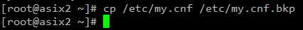  

Finalment, comprovem si hem copiat l'arxiu correctament al directori on pertoca.   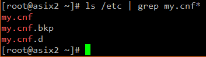    

- Modifica el fitxer <i>/etc/my.conf</i> i activa el paràmetre <i><b>log-bin</b></i> (tal i com vàreu fer a M02) amb el nom: <i><PRIMER LLETRA DEL NOM + 1r COGNOM>rep</i>.  

Modifiquem el fitxer <i>my.cnf</i> afegint-hi el paràmetre <i><b>log-bin=enorat_gorriols_atarensi.log</b></i>.   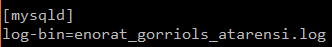    

- Verifica que el paràmetre server-id té un valor numèric (per defecte és 1).  

Hem de reiniciar el servei de MySQL després d'haver fet el canvi anterior per guardar-lo, i un cop ho haguem fet, comprovem el log que hem creat utilitzant la comanda <i><b>mysqlbinlog /usr/mysql/log/enorat_gorriols_atarensi.000001</b></i>.   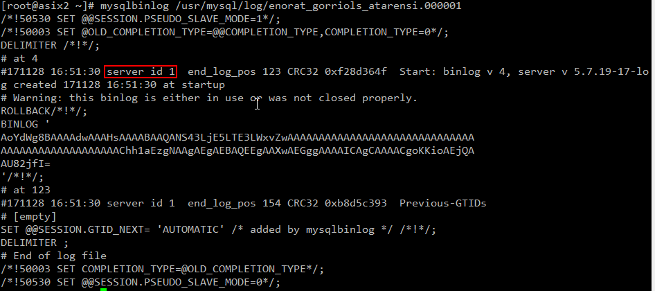    

- Verifica que tots els paràmetres de InnoDB estiguin descomentats.  

Tots els paràmetres venen descomentats a la versió 5.7 de Percona-Server, per tant, no hem hagut de modificar res. En cas de que volguem comentar algun paràmetre, només hem d'utilitzar el hashtag (<i>#</i>).    

- Canvia el paràmetre <i>innodb_log_buffer</i> a 10M.  

Entrem al fitxer de configuració i hi afegim el paràmetre <i><b>innodb_log_buffer_size=10MB</b></i>. El log-buffer és un espai de memòria que manté les dades abans de ser escrites en el fitxer físic de redo log. Aquest paràmetre és el que en determina la mida.   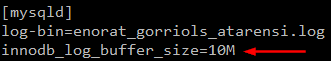    

- Canvia o afegeix el paràmetre <i>innodb_log_files_in_group</i> a 2.  

Afegim el paràmetre al fitxer de configuració com hem fet ja anteriorment. La sentència hauria de ser <i><b>innodb_log_files_in_group=2</b></i>. Aquest paràmetre determina el número de logs màxim en un grup de logs, i el seu paràmetre mínim és 2.   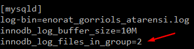    

- Aquí parem el servei de MySQL, borrem tots els logs d'InnoDB del directori <i>/var/lib/mysql</i> i tornem a engegar el procés de MySQL.  

- Quants fitxers comencen amb el nom <i><PRIMER LLETRA DEL NOM + 1r COGNOM>rep</i> dins el directori <i>/var/lib/mysql</i>? Digues quins són.  

Comprovem que hi ha dins la ruta <i>/var/lib/mysql</i>, i s'hi poden veure dos fitxers que comencen per <b>enorat_gorriols_atarensi</b>:

  1. <i><b>enorat_gorriols_atarensi.000001</b></i>: És el fitxer que inclou les dades de log, és a dir, el log en sí. 
  2. <i><b>enorat_gorriols_atarensi.index</b></i>: És el fitxer que indexa els logs. 
  
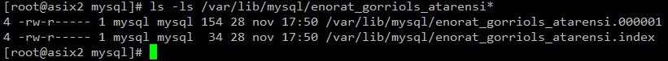    

- Realitza un instrucció DML, per exemple INSERT, UPDATE o DELETE.  

Per fer aquest exemple, hem creat una taula anomenada "pro". Per fer la prova farem varis INSERT dins d'aquesta taula.   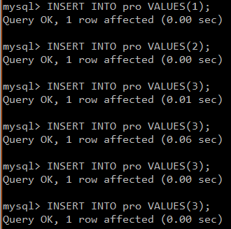   

També hem decidit provar amb un UPDATE a la mateixa taula, per tal de fer més proves i que el resultat sigui més divers.   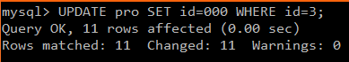    

- Obre un altre terminal i utilitzant l'eina mysqlbinlog mira el contingut del fitxer <PRIMER LLETRA DEL NOM + 1r COGNOM>rep.000001. Quin és el seu contingut?  

Per comprovar el contingut del fitxer log on hi ha la informació dela INSERTS i UPDATE anteriors, hem d'utilitzar la sentència <i><b>mysqlbinlog enorat_gorriols_atarensi.000001</b></i>.   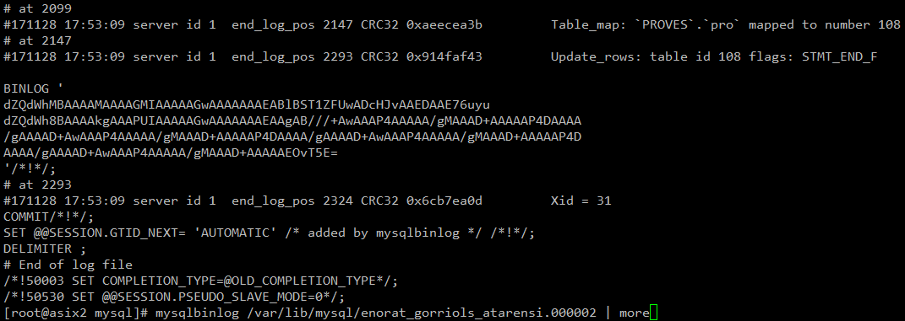    

- Fes un FLUSH DELS LOGS utilitzant la comanda <b>FLUSH LOGS</b> dins del MySQL. Realitza una comprovació dels logs com a master mitjançant <b>SHOW MASTER LOGS</b>.

La comanda <i>FLUSH LOGS;</i> serveix per generar un nou registre (log). Recordem que en l'anterior exercici, l'extensió del log era <i><b>.000001</b></i>, i després de fer el FLUSH, ens en crearà un altre. Ho podem, comprovar amb la sentència <i>SHOW MASTER LOGS;</i>, que ens mostra els logs que tenim a la nostra BD.   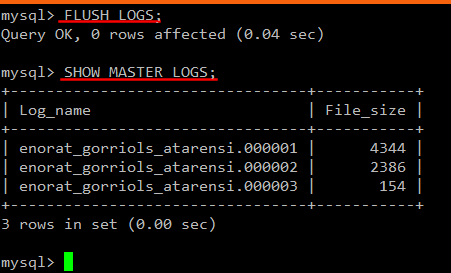   

 

### Configuració <i>Slave i Master</i>

 

- Realitza una còpia de la màquina virtual a on tinguis SGBD MySQL. Aquesta nova màquina serà que farà d'eslau.  

- Esbrina quina IP tenen cadascuna de les màquines (master, slave).  

Hem fet la còpia de la màquina MASTER. La màquina MASTER té la IP <b>192.168.47.10</b>, mentre que la màquina SLAVE té la IP <b>192.168.47.12</b>.    

- Crea un backup de la BD a la màquina master utilitzant la sentència <i><b>$> mysqldump –-user=root –-password=vostrepwd -–master-data=2 sakila > /tmp/master_backup.sql</b></i>.  

Utilitzem la sentència mysqldump per replicar la nostra BD. Un cop executada, simplement ens avisarà de que és perillós utilitzar la contrasenya a la línia de comandes.   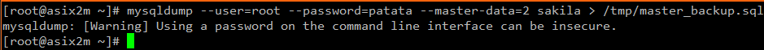  

- Edita el fitxer master_backup.sql i busca la línia que comenci per <i><b>--CHANGE MASTER TO...</b></i> i busca els valors MASTER_LOG_FILE i MASTER_LOG_POS.  

Editem el fitxer indicat i busquem la línia <i>--CHANGE MASTER TO</i>. Els dos paràmetres que hi haa a la línia són MASTER_LOG_FILE i MASTER_LOG_POS. Aquest paràmetres són els que es coordinen la màquina SLAVE amb la MASTER; en el primer s'hi especifica un log concret, i en el segon assigna la posició del log.   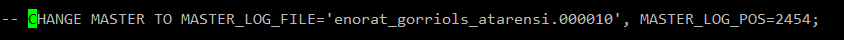   

- A la màquina SLAVE...
  - Para el servei de MySQL.
  - Modifica el fitxer de configuració <i>/etc/my.cnf</i>.
    - Comenta els paràmetres <b>log-bin</b> i <b>binlog_format</b>. D'aquesta manera desactivarem el sistema de log-bin.
    - Assigna un valor al paràmetre <b>server-id</b> (diferent que el del Master).
    - Torna a engegar el servei MySQL.
 
 
 
Primer de tot parem el servei de MySQL amb la comanda que utilitzem normalment. Després obrim el fitxer de configuració de MySQL (situat a <i>/etc/my.cnf</i>) i busquem els dos paràmetres referents al binlog (log-bin i binlog_format). En el nostre cas només tenim el <i><b>log-bin</b></i>, i l'únic que hem de fer és comentar-lo.   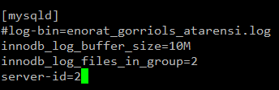  

Per últim, només hem de tornar a iniciar el servei de MySQL. Aquestes serien les comandes que hem de fer per configurar l'SLAVE (juntament amb la configuració anterior).   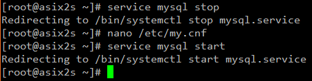   

- A la màquina MASTER...
  - Afegeix l'usuari slave amb la IP de la màquina slave.
  - Afegix el permís de REPLICATION SLAVE a l'usuari que acabes de crear.
    - --> mysql> GRANT REPLICATION SLAVE ON *.*
    - --> > TO 'slave'@'IP-SERVIDOR-SLAVE';
    - --> mysql> FLUSH PRIVILEGES;
    
 

Des de la màquina MASTER afegirem un usuari a la IP assignada al nostre servidor SLAVE. Crearem l'usuari d'aquesta manera.  

    mysql> CREATE USER 'slave'@'IP-SERVIDOR-SLAVE'
        -> IDENTIFIED BY 'patata';

  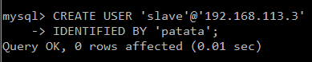  

Ara hi afegirem el permís de <b>REPLICATION SLAVE</b> a l'usuari <i>slave</i> que hem creat anteriorment. Per donar-hi els permisos necessaris, hem de posar les següents sentències.  

    mysql> GRANT REPLICATION SLAVE ON *.*
        -> TO 'slave'@'IP-SERVIDOR-SLAVE';
    mysql> FLUSH PRIVILEGES;
    
  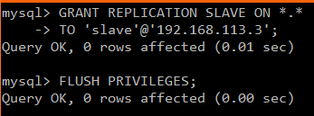   

- A la màquina SLAVE executa la següent comanda ajudant-te de les dades del pas 3 i 4:  

A continuació, enllaçaerem l'SLAVE amb el master amb un seguit de paràmetres. La sintaxi per fer aquest pas, seria aquesta.  

    mysql> CHANGE MASTER TO
        -> MASTER_HOST = '<ip-servidor-master>',
        -> MASTER_USER = 'slave',
        -> MASTER_PASSWORD = 'patata',
        -> MASTER_PORT = '3306',
        -> MASTER_LOG_FILE = '<PRIMER LLETRA DEL NOM + 1r COGNOM>rep.000002',
        -> MASTER_LOG_POS = <valor trobat en el pas 4>,
        -> MASTER_CONNECT_RETRY = 10;

  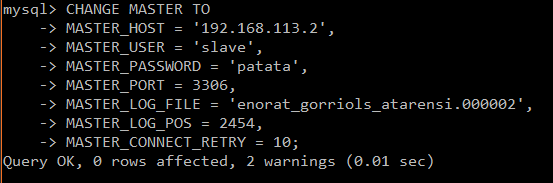  
