# Pràctica 5

## Clustering amb Percona XtraDB Cluster

Per fer aquesta pràctca, utilitzarem 4 Clusters.

1. Node 1: NodeID = 1; HostName: Percona1; IP: 192.168.26.71
2. Node 2: NodeID = 2; HostName: Percona2; IP: 192.168.26.72
3. Node 3: NodeID = 3; HostName: Percona3; IP: 192.168.26.73
4. Node 4: NodeID = 4; HostName: Percona4; IP: 192.168.26.74

 

Abans de començar, haurem de desactivar el firewall (en el nostre cas per ser un entorn de prova) o permetre passar els paquets pels ports que necessitem, que són els següents: <b><i>3306, 4444, 4567, 4568</i></b>. Per desactivar el firewall de CentOS, utilitzarem a comanda <b>systemctl disable firewalld</b>.    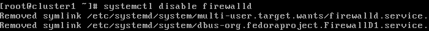  

També hem de configurar les interfícies, que en el cas de CentOS, és un pèl diferent a altres sistemes Linux. Podeu trobar el tutorial aquí: http://ask.xmodulo.com/configure-static-ip-address-centos7.html. La IP del node base és la 192.168.26.71, i aquí la tenim configurada.    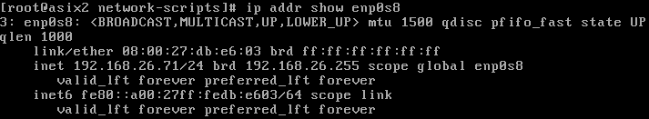  

També és recomenable canviar el nom de la màquina, que es pot fer fàcilment d'aquesta manera: https://www.cyberciti.biz/faq/rhel-redhat-centos-7-change-hostname-command/.    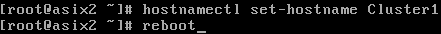   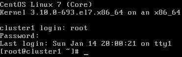   

També hem de desactivar SELinux per si de cas (segons la pàgina oficial de Percona). Per fer-ho, hem d'editar el fitxer <i>/etc/selinux/config</i> i editar la línia <b>SELINUX=disabled</b>. Després, únicament hem de reiniciar la màquina, i un cop reiniciada, per saber si hem desactivar correctament SELinux, hem d'utilitzar la comanda <b>getenforce</b> Per més informació, pots consultar aquesta pàgina: https://access.redhat.com/documentation/en-us/red_hat_enterprise_linux/6/html/security-enhanced_linux/sect-security-enhanced_linux-enabling_and_disabling_selinux-disabling_selinux.    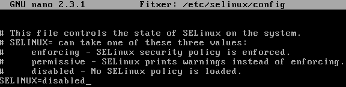   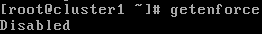  

Un cop fets aquests passos previs, haurem d'instal·lar els repositoris. Per fer-ho, utilitzem següent comanda per baixar-nos la última versió de la llista de descarregables de Percona.    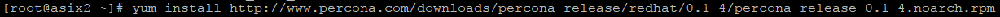  

Per comprovar que es paquets són els correctes podem fer un grep, i ens haurien de sortir, més o menys, d'aquesta forma.    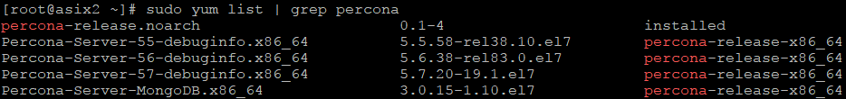  

Ara només haurem d'instal·lar l'XtraDB a la nostra màquina. Per fer-ho, utlilitzarem la següent comanda.    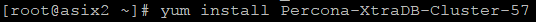  

Un cop instal·lat XtraDB al nostre servidor, iniciarem el servei de MySQL.    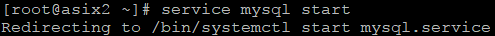  

El següent pas, serà configurar una contrasenya per al nostre usuari "root" de MySQL. XtraDB li assigna a aquest usuari una contrasenya temporal, que podem veure a través del log situat a /var/log/mysqld.log. Aquesta string és aleatòria, és a dir, és diferent cada cop que instal·lem i desinstal·lem el Percona, i canvia si ho fem en una altra màquina.    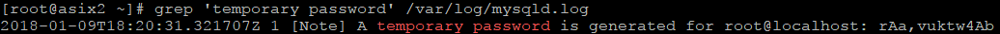  

El que farem a continuació és entrar a la shell de MySQL a través de l'usuari "root" amb la contrasenya temporal que acabem d'obtenir. Per entrar-hi, haurem d'utilitzar la següent comanda: <b>mysql -u <i>[usuari]</i> -p<i>[contrasenya]</i></b>.    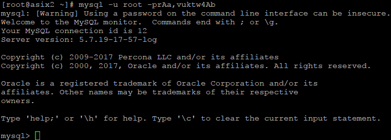  

Ara només quedarà canviar aquesta contrasenya per una de més senzilla. La sentència per canviar la contrasenya a un usuari MySQL és aquesta: <b>ALTER USER '<i>[usuari]</i>'@'<i>[màquina]</i>' IDENTIFIED BY '<i>[nova contrasenya]</i>';</b>.    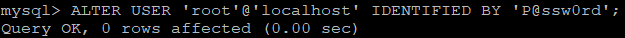  

Un cop arribats a aquest punt, clonarem la màquina virtual. El que faré en aquest cas serà fer una clonació completa com a backup i a partir d'aquesta clonació completa, fer-ne tres d'entrellaçades. A aquestes clonacions entrellaçades, els hi haurem de canviar el hostname i la IP, tal com hem fet abans amb la primera. SELinux hauria d'estar deshabilitat, però s'aconsella posar la comanda de comprovació.  

Després d'haver configurat totes les màquines del cluster, hem de comprovar que es puguin veure entre elles. Per comprovar-ho, farem pings entre totes les màquines i des de totes les màquines. Exemple. Màquina Cluster1 fent ping a Cluster2:    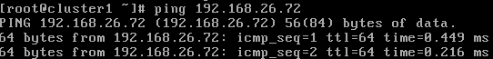  

Ara haurem d'editar el fitxer /etc/my.cnf, però abans farem un backup d'aquest fitxer per si de cas.    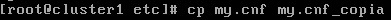  

Obrim el fitxer /etc/my.cnf i l'editem amb els següents paràmetres (personalitzant-los, obviament, segons les nostres necessitats).

    [mysqld]
    
    datadir=/var/lib/mysql
    user=mysql

    # Path to Galera library
    wsrep_provider=/usr/lib64/libgalera_smm.so

    # Cluster connection URL contains the IPs of node#1, node#2 and node#3
    wsrep_cluster_address=gcomm://192.168.70.71,192.168.70.72,192.168.70.73

    # In order for Galera to work correctly binlog format should be ROW
    binlog_format=ROW

    # MyISAM storage engine has only experimental support
    default_storage_engine=InnoDB

    # This changes how InnoDB autoincrement locks are managed and is a requirement for Galera
    innodb_autoinc_lock_mode=2

    # Node #1 address
    wsrep_node_address=192.168.70.71

    # SST method
    wsrep_sst_method=xtrabackup-v2

    # Cluster name
    wsrep_cluster_name=my_centos_cluster

    # Authentication for SST method
    wsrep_sst_auth="sstuser:s3cret"

Un cop editat el fitxer del primer cluster, hem de fer el mateix amb els altres, però només canviant els paràmetres ressaltats dins del requadre vermell. <b>IMPORTANT! No t'oblidis de la capçalera <i>[mysqld]</i>, ja que sino no d'iniciarà el servei de MySQL</b>.   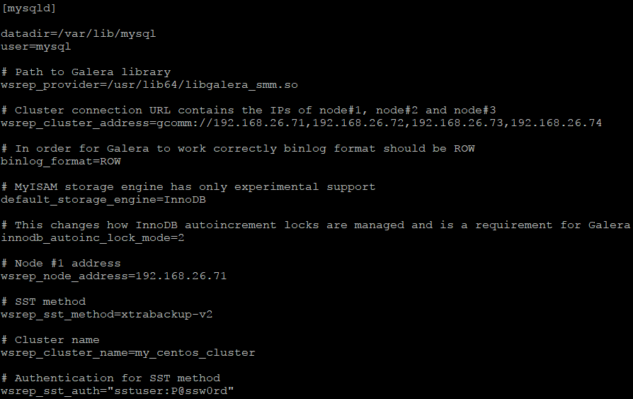  

Quan haguem configurat els fitxers de tots els clusters, haurem de crear l'usuari SST al node que farem servir com a "Bootstrapping" (cluster1) i donar-li els privilegis necessaris. Abans d'això, però, reiniciarem el servei MySQL.    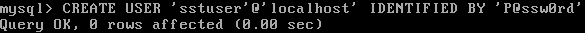   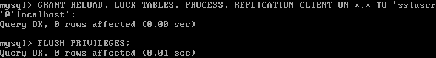  

 
 
 
 
 
 
 
 
 
 

Abans de començar, haurem de desactivar el firewall (en el nostre cas per ser un entorn de prova) o permetre passar els paquets pels ports que necessitem, que són els següents: <b><i>3306, 4444, 4567, 4568</i></b>. Si volem permetre passar els paquets pels ports en concret requerits, utilitzarem la comanda <b>ufw allow <i>[número de port]</i></b>. Per desctivar el firewall, utilitzarem al comanda <b>ufw disable</b>.  

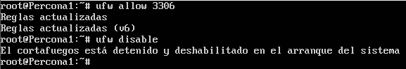  

Un cop deshabilitat el firewall, procedim a instal·lar l'XtraDB. Per poder-lo instal·lar, primer hem de descarregar i instal·lar els repositoris, o bé actualitzar-los en cas que els tinguem descarregats.  

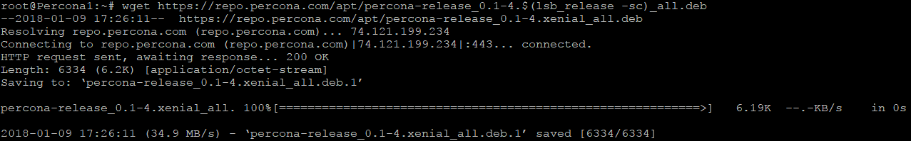  

Un cop descarregat, desempaquetem i l'istal·lem/actualitzem la llista dels repositoris.  

  

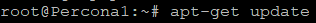  

Podem confirmar que s'han atualitzat els repositoris buscant el paquet que volem instal·lar.  

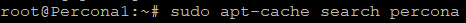  

Al confirmar que si tenim els repositoris dels paquets, procedim a instal·lar el nostre paquet XtraDB.  

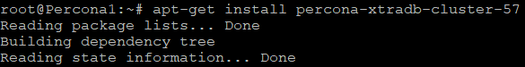  

I per acavar ens demanarà una contrasenya.  

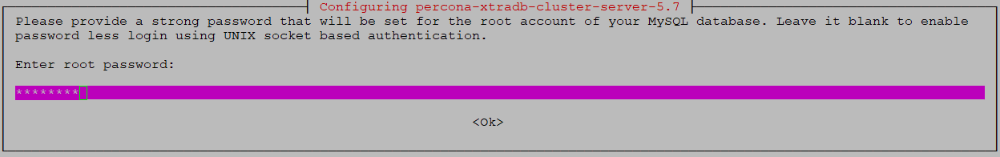  
