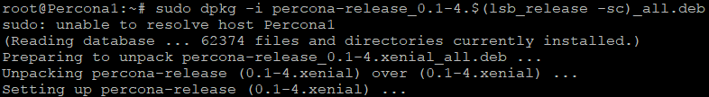

# Pràctica 5

## Clustering amb Percona XtraDB Cluster

Per fer aquesta pràctca, utilitzarem 4 Clusters.

1. Slave Cluster 1: NodeID = 1; HostName: Percona1; IP: 192.168.26.71
2. Slave Cluster 2: NodeID = 2; HostName: Percona2; IP: 192.168.26.72
3. Slave Cluster 3: NodeID = 3; HostName: Percona3; IP: 192.168.26.73
4. Slave Cluster 3: NodeID = 4; HostName: Percona4; IP: 192.168.26.74

 

Abans de començar, haurem de desactivar el firewall (en el nostre cas per ser un entorn de prova) o permetre passar els paquets pels ports que necessitem, que són els següents: <b><i>3306, 4444, 4567, 4568</i></b>. Si volem permetre passar els paquets pels ports en concret requerits, utilitzarem la comanda <b>ufw allow <i>[número de port]</i></b>. Per desctivar el firewall, utilitzarem al comanda <b>ufw disable</b>.  

  

Un cop desabilitat el firewall, procedim a instal·lar el XtraDB.  

  
