# Optimització de consultes

## Part 1

Escriu les sentències SQL per tal d’obtenir els que se’ns demana. A més a més si creus que la sentència es pot millorar amb la incorporació d’un índex i/o modificació de l’esquema (sense alterar-ne el comportament),etc... Afegeix la sentència DDL i l’output de EXPLAIN mostrant la millora (EXPLAIN sense índex i EXPLAIN amb índex). Si creus que la consulta no es pot millorar mitjançant índexs justifica el perquè. Nota: No milloreu les sentències amb índexs complerts.   

1. Obtenir el nom i l’adreça dels hotels de 4 estrelles.  

        SELECT nom, adreca
          FROM hotels
          WHERE categoria = 4;

Explains sense índex:   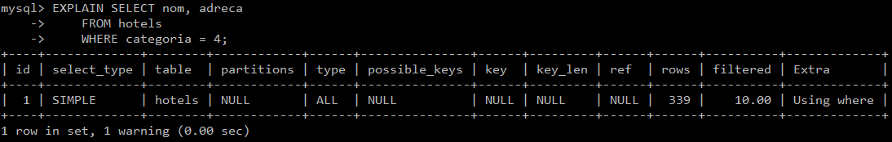   

2. Obtenir el nom dels clients (Nom i cognom) que el seu cognom comenci per vocal (sense tenir en compte els accents).  

        SELECT nom, cognom1
          FROM clients
          WHERE cognom1 RLIKE "^[aeiou]";

Explains sense índex:   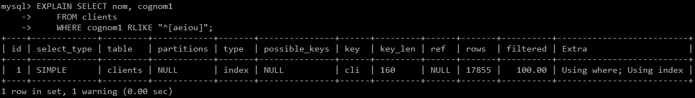   

3. Quina és la reserva_id que té més nits. Indica també la quantitat de nits.  

        SELECT r1.reserva_id, TIMESTAMPDIFF(DAY,r1.data_inici,r1.data_fi) AS Nits
          FROM reserves r1
          WHERE TIMESTAMPDIFF(DAY,r1.data_inici,r1.data_fi) = (SELECT MAX(TIMESTAMPDIFF(DAY,r2.data_inici,r2.data_fi))
                                                            FROM reserves r2);

Explains sense índex:   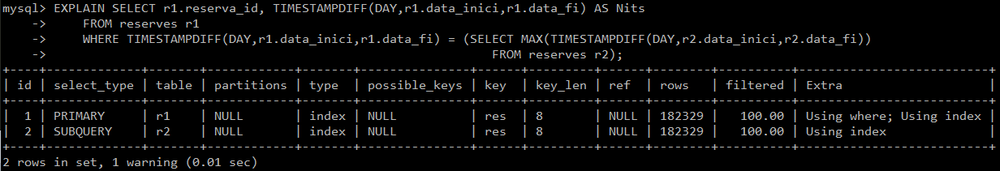   

4. Quantes reserves va rebre l’hotel ‘Catalonia Ramblas’ de Barcelona durant tot  l’any 2015 (una reserva pertany al 2015 si alguna nit d’aquesta reserva era del 2015).  

        SELECT COUNT(*) AS Reserves_2015
          FROM reserves r
          INNER JOIN habitacions hab ON hab.hab_id = r.hab_id
          INNER JOIN hotels h ON h.hotel_id = hab.hotel_id
          WHERE YEAR(data_inici) = 2015 AND h.nom = 'Catalonia Ramblas' ;

Explains sense índex:   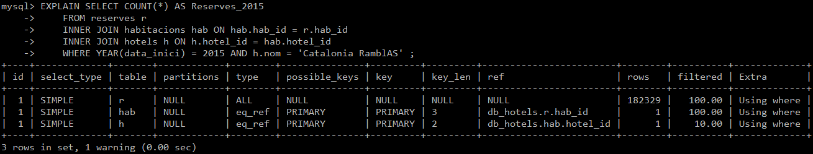   

5. Obtenir el nom i cognoms dels clients que varen néixer el mes de Març.  

        SELECT nom, cognom1, data_naix
          FROM clients
          WHERE MONTH(data_naix) = 3;

Explains sense índex:      

6. Quantitat d’hotels de 4 estrelles de la població de Barcelona.  

        SELECT COUNT(*)
          FROM hotels h
          WHERE h.categoria = 4 AND h.poblacio_id = (SELECT po.poblacio_id
                                                  FROM poblacions po
                                                  WHERE po.nom = "Barcelona");

Explains sense índex:   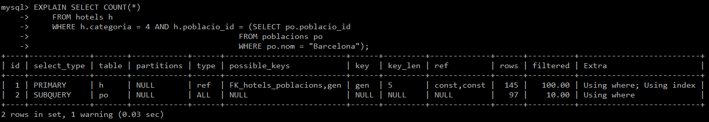   

7. De l’any 2015 volem obtenir els seu histograma de reserves. És a dir volem saber el número de reserves de cadascun dels mesos. Una reserva pertany a un mes si la alguna nit d’aquella reserva cau a dins de l’any 2015.  

        SELECT MONTH(data_inici), COUNT(*) AS Reserves_2015
          FROM reserves r
          INNER JOIN habitacions hab ON hab.hab_id = r.hab_id
          INNER JOIN hotels h ON h.hotel_id = hab.hotel_id
          WHERE YEAR(data_inici) = 2015
          GROUP BY MONTH(data_inici);

Explains sense índex:   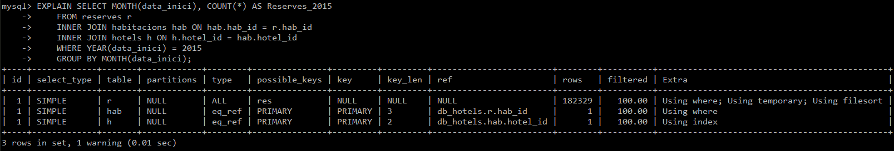   

8. El nom dels hotels que tenen com a mínim una habitació lliure durant les dates ‘2015-05-01’ i ‘2015-05-17’.  

        SELECT h.nom, (h.habitacions-COUNT(hab.hotel_id)) AS Habitacions_lliures
          FROM reserves r
          INNER JOIN habitacions hab ON hab.hab_id = r.hab_id
          INNER JOIN hotels h ON h.hotel_id = hab.hotel_id
          WHERE (r.data_inici <= '2015-05-01' AND r.data_fi >= '2015-05-17') 
          GROUP BY h.hotel_id;

Explains sense índex:      

9. Obtenir la quantitat de reserves que s’inicien en cadascun dels dies de la setmana. Tenint en compte només l’any 2016.  

        SELECT DAYOFWEEK(data_inici), COUNT(*) AS Reserves_2016
          FROM reserves r
          INNER JOIN habitacions hab ON hab.hab_id = r.hab_id
          INNER JOIN hotels h ON h.hotel_id = hab.hotel_id
          WHERE YEAR(data_inici) = 2016
          GROUP BY DAYOFWEEK(data_inici);

Explains sense índex:      

10. Durant 2014 qui va realitzar més reserves? Els homes o les dones? Mostra el sexe i el número de reserves.  

        SELECT IF(SUM(c.sexe='F')>SUM(c.sexe='M'),'Dones','Homes') AS MesReserves, COUNT(*)
          FROM reserves r
        INNER JOIN clients c ON c.client_id = r.client_id
        WHERE YEAR(r.data_inici) = 2014;

Explains sense índex:   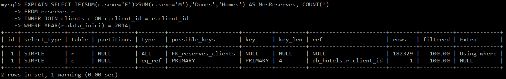   

11. Quina és la mitjana de dies de reserva per l’hotel «HTOP Royal Star» de Blanes durant l’any 2016? (Una reserva pertany el 2016 si alguna nit cau en aquest any).  

        SELECT nom, categoria, adreca,(SELECT max(num_hab)
                                FROM (SELECT count(hab_id) AS num_hab,hotel_id 
                                        FROM habitacions GROUP BY hotel_id)max_hab2)AS num_hab
          FROM hotels
        WHERE hotel_id = (SELECT hotel_id 
          FROM habitacions 
        GROUP BY hotel_id
        HAVING count(hab_id)=(SELECT max(num_hab)
                                        FROM (SELECT count(hab_id) AS num_hab,hotel_id 
                                                FROM habitacions GROUP BY hotel_id)max_hab));

Explains sense índex:      

12. El nom, categoria, adreça i número d’habitacions de l’hotel amb més habitacions de la BD.  

        SELECT ho.nom,ho.categoria,ho.adreca,COUNT(ha.hab_id) AS num_habitacions
          FROM hotels ho
        INNER JOIN habitacions ha ON ho.hotel_id = ha.hotel_id
        GROUP BY ho.hotel_id
        ORDER BY num_habitacions DESC LIMIT 1;

Explains sense índex:   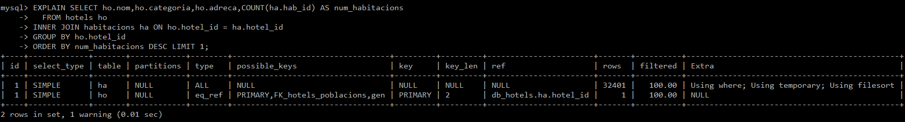   

13. Rànquing de 5 països amb més reserves durant l’any 2016. Per cada país mostrar el nom del país i el número de reserves.  

        SELECT COUNT(*) AS numReserves, p2.nom
                FROM reserves r2
                INNER JOIN clients c2 ON c2.client_id = r2.client_id
                INNER JOIN paisos p2 ON p2.pais_id = c2.pais_origen_id
                WHERE  YEAR(r2.data_inici) = 2016
        GROUP BY p2.pais_id
        ORDER BY numReserves DESC
        LIMIT 5;

Explains sense índex:      

14. Codi client, Nom, Cognom, del client que ha realitzat més reserves de tota la BD.  

        SELECT c.client_id,c.nom,c.cognom1,COUNT(r.reserva_id) AS num_reserves
          FROM clients c
        INNER JOIN reserves r ON r.client_id = c.client_id
        GROUP BY c.client_id 
        ORDER BY num_reserves DESC LIMIT 1;

Explains sense índex:      

15. Codi client, Nom, Cognom, del client que ha realitzat més reserves durant el mes d’agost de l’any 2016. Les reserves a comptabilitzar són totes aquelles que en algun dia del seu període cau en el mes d’agost.  

        SELECT  r.client_id AS Client, c.nom, c.cognom1, COUNT(*) AS NumReserves
          FROM reserves r
        INNER JOIN clients c ON c.client_id = r.client_id
        WHERE (r.data_inici <= '2016-08-31' 
              AND r.data_fi >= '2016-08-1')
        GROUP BY r.client_id
        HAVING COUNT(*) = (SELECT MAX(contReserves.NumReserves)
                             FROM (SELECT COUNT(*) AS NumReserves, r.client_id AS Client, c.nom
                                     FROM reserves r
                                   INNER JOIN clients c ON c.client_id = r.client_id
                                   WHERE (r.data_inici <= '2016-08-31' 
                                         AND r.data_fi >= '2016-08-1')
                                   GROUP BY r.client_id) contReserves);

Explains sense índex:      

16. Quin és el país que en tenim menys clients?  

        SELECT p.nom, COUNT(*) AS num_clients
          FROM clients c
          INNER JOIN paisos p ON c.pais_origen_id = p.pais_id
        GROUP BY p.pais_id
        ORDER BY num_clients ASC LIMIT 1;

Explains sense índex:   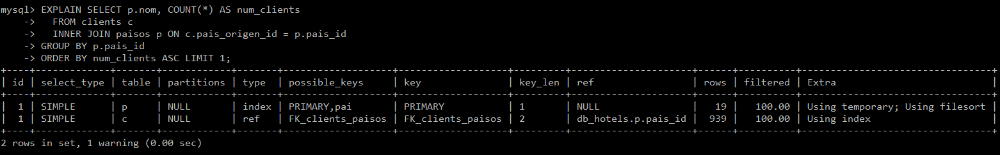   

17. Quina és la mitjana de nits dels clients provinents d’‘HOLANDA’ per l’any 2016?  

        SELECT AVG(anys.numReserves) AS MitjanaReserves
          FROM (SELECT COUNT(*) AS numReserves
                        FROM reserves r2
                            INNER JOIN clients c2 ON c2.client_id = r2.client_id
                            INNER JOIN paisos p2 ON p2.pais_id = c2.pais_origen_id
                            WHERE  p2.nom = 'HOLANDA'
                            GROUP BY YEAR(r2.data_inici))anys;

Explains sense índex:   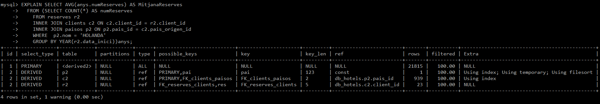   

18. Digues el nom i cognoms dels clients que el seu cognom sigui ‘Bahi’.  

        SELECT nom,cognom1 AS cognoms
          FROM clients
        WHERE cognom1="Bahi";

Explains sense índex:      

19. Quins clients (nom, cognoms) segueixen el patró de que el seu cognom comenci per la lletra ‘p’  i seguida d’una vocal.  

        SELECT nom, cognom1
            FROM clients
          WHERE LOWER(cognom1) REGEXP '^p[a,e,i,o,u]';

Explains sense índex:   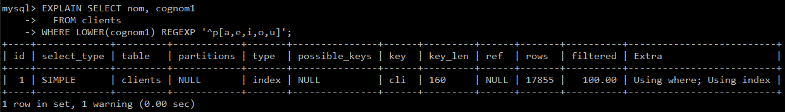   

20. Quin és l’hotel de 4 estrelles amb més reserves durant tot el 2015 ( una reserva pertany el 2015 si alguna de les nits hi pertany).  

        SELECT ho2.hotel_id, ho2.nom, ho2.categoria
          FROM hotels ho2
        INNER JOIN habitacions h2 on ho2.hotel_id = h2.hotel_id
        WHERE h2.hab_id = (SELECT hab_id
                            FROM (SELECT h1.hab_id
                                    FROM reserves r1
                                  INNER JOIN habitacions h1 ON r1.hab_id = h1.hab_id
                                  INNER JOIN hotels ho1 ON h1.hotel_id = ho1.hotel_id
                                  WHERE (YEAR(r1.data_inici)= 2015 OR YEAR(r1.data_fi)= 2015) AND ho1.categoria=4)hotel4
                          GROUP BY hab_id
                          HAVING COUNT(hab_id) = (SELECT MAX(num_res)
                                                    FROM (SELECT hab_id, count(hab_id) AS num_res
                                                            FROM (SELECT h1.hab_id
                                                                    FROM reserves r1
                                                                  INNER JOIN habitacions h1 ON r1.hab_id = h1.hab_id
                                                                  INNER JOIN hotels ho1 ON h1.hotel_id = ho1.hotel_id
                                                                  WHERE (YEAR(r1.data_inici)= 2015 OR YEAR(r1.data_fi)= 2015) AND ho1.categoria=4)hotel4
                                                  GROUP BY hab_id)reserves));

Explains sense índex:   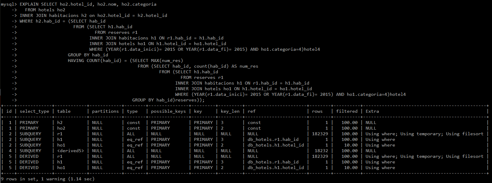   

21. Quin és l’hotel amb més reserves (tota la BD).  

        SELECT  h.hotel_id, ho.nom, ho.categoria
          FROM habitacions h 
        INNER JOIN hotels ho ON ho.hotel_id = h.hotel_id
          WHERE hab_id = (SELECT hab_id
            FROM reserves
          GROUP BY hab_id
          HAVING COUNT(hab_id)=(SELECT MAX(num_hab)
              FROM(SELECT hab_id, COUNT(hab_id) AS num_hab
                    FROM reserves
                   GROUP BY hab_id)max_reserves));

Explains sense índex:      

22. Quin és el país amb més reserves? (tots els anys) O sigui, quin és el país d’on han vingut més turistes.  

        SELECT p.nom,COUNT(*) AS num_reserves
          FROM paisos p
          INNER JOIN clients c ON c.pais_origen_id = p.pais_id
          INNER JOIN reserves r ON r.client_id = c.client_id
        GROUP BY p.pais_id
        ORDER BY num_reserves DESC LIMIT 1;

Explains sense índex:      

